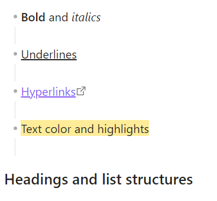
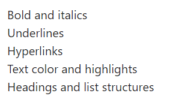

# SuperClean Paste

A simple plugin for Obsidian that automatically cleans up pasted text by removing extra blank lines and all rich text formatting. When you copy content from web pages, it often comes with unwanted empty lines. This plugin solves that by replacing multiple consecutive newlines with a single newline upon pasting.

## How to Use

1.  Install the plugin from the Community Plugins browser in Obsidian.
2.  Enable the plugin in your settings.
3.  That's it! Now, whenever you paste text (`Ctrl+V` or `Cmd+V`), it will be automatically cleaned.

## ⚠️ Important Note on Formatting

This plugin's primary goal is to paste the cleanest possible text. In addition to fixing line breaks, **it will also remove all original rich text formatting**.

This includes:
- **Bold** and *italics*
- <u>Underlines</u>
- [Hyperlinks](https://obsidian.md)
- Text color and highlights
- Headings and list structures

You will get pure, unformatted plain text with correct line breaks, which you can then format within Obsidian as needed.

## Demo
Before

After
